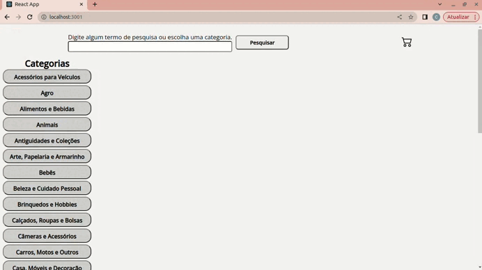

# Online Store Project
<!-- Improved compatibility of back to top link: See: https://github.com/edmcorrea/project-app-de-receitas--/blob/main/README.md -->

<!-- PROJECT SHIELDS -->
<!--
*** I'm using markdown "reference style" links for readability.
*** Reference links are enclosed in brackets [ ] instead of parentheses ( ).
*** See the bottom of this document for the declaration of the reference variables
*** for contributors-url, forks-url, etc. This is an optional, concise syntax you may use.
*** https://www.markdownguide.org/basic-syntax/#reference-style-links
-->

<!-- PROJECT LOGO -->

  <h3 align="center"> MERCADO ONLINE STORE</h3>
    
 O que você precisa, perto de você! 

  
  

    
  

  
   
  
  <!-- 

    <a href="https://projeto-music-stream-spotunes.vercel.app/"><strong>NAVEGUE NA VERSÃO DEMO WEB»</strong></a>
  
 -->

<!-- TABLE OF CONTENTS -->

  
Índice

  <ol>
    <li>
      <a href="#sobre-o-projeto">Sobre o Projeto</a>
      <ul>
        <li><a href="#construído-com">Construído com</a></li>
      </ul>
    </li>
    <li><a href="#uso">Uso</a></li>
    <li><a href="#contato">Contato</a></li>
  </ol>

<!-- ABOUT THE PROJECT -->
## Sobre o Projeto

<!-- [![Product Name Screen Shot][product-screenshot]](https://example.com) -->

Desenvolvido uma página / plataforma de mercado online, utilizando o ecossistema React!

Foi criado uma versão simplificada, sem persistência no banco de dados, de uma loja online,
desenvolvendo em grupo suas funcionalidades de acordo com demandas definidas
em um quadro Kanban, em um cenário próximo ao do mercado de trabalho.

(<a href="#readme-top">Voltar ao Topo</a>)

### Construído com

<!-- This section should list any major frameworks/libraries used to bootstrap your project. Leave any add-ons/plugins for the acknowledgements section. Here are a few examples. -->

* [![React][React.js]][React-url]
* [![Bootstrap][Bootstrap.com]][Bootstrap-url]

(<a href="#readme-top">Voltar ao topo</a>)

<!-- USAGE EXAMPLES -->
## Uso

Na tela principal, há a barra de pesquisa na barra de navegação superior, sendo possível procurar pelos produtos desejados.
Além disso, é possível fazer consulta similar baseado na categoria do produto na barra lateral esquerda. Clicando em algum dos produtos, é possível ir para a página de DETALHES DO PRODUTO.

Na página de DETALHES DO PRODUTO, é possível adicionar um comentário do produto, além de adiciona-lo ao CARRINHO, ou COMPRÁ-LO.

Na página de CARRINHO, é possível visualizar os pedido adicionados, além de incrementar ou decrementar a quantidade desejada.

<!-- _=For more examples, please refer to the [Documentation](https://example.com)_ -->

(<a href="#readme-top">Voltar ao topo</a>)

<!-- CONTACT -->
## Contato

Edmilson Corrêa - edm.correa@hotmail.com

Link do Projeto: https://github.com/edmcorrea/Online-Story

(<a href="#readme-top">Voltar ao topo</a>)

<!-- MARKDOWN LINKS & IMAGES -->
<!-- https://www.markdownguide.org/basic-syntax/#reference-style-links -->
[contributors-shield]: https://img.shields.io/github/contributors/othneildrew/Best-README-Template.svg?style=for-the-badge
[contributors-url]: https://github.com/othneildrew/Best-README-Template/graphs/contributors
[forks-shield]: https://img.shields.io/github/forks/othneildrew/Best-README-Template.svg?style=for-the-badge
[forks-url]: https://github.com/othneildrew/Best-README-Template/network/members
[stars-shield]: https://img.shields.io/github/stars/othneildrew/Best-README-Template.svg?style=for-the-badge
[stars-url]: https://github.com/othneildrew/Best-README-Template/stargazers
[issues-shield]: https://img.shields.io/github/issues/othneildrew/Best-README-Template.svg?style=for-the-badge
[issues-url]: https://github.com/othneildrew/Best-README-Template/issues
[license-shield]: https://img.shields.io/github/license/othneildrew/Best-README-Template.svg?style=for-the-badge
[license-url]: https://github.com/othneildrew/Best-README-Template/blob/master/LICENSE.txt
[linkedin-shield]: https://img.shields.io/badge/-LinkedIn-black.svg?style=for-the-badge&logo=linkedin&colorB=555
[linkedin-url]: https://linkedin.com/in/othneildrew
[product-screenshot]: images/screenshot.png
[Next.js]: https://img.shields.io/badge/next.js-000000?style=for-the-badge&logo=nextdotjs&logoColor=white
[Next-url]: https://nextjs.org/
[React.js]: https://img.shields.io/badge/React-20232A?style=for-the-badge&logo=react&logoColor=61DAFB
[React-url]: https://reactjs.org/
[Vue.js]: https://img.shields.io/badge/Vue.js-35495E?style=for-the-badge&logo=vuedotjs&logoColor=4FC08D
[Vue-url]: https://vuejs.org/
[Angular.io]: https://img.shields.io/badge/Angular-DD0031?style=for-the-badge&logo=angular&logoColor=white
[Angular-url]: https://angular.io/
[Svelte.dev]: https://img.shields.io/badge/Svelte-4A4A55?style=for-the-badge&logo=svelte&logoColor=FF3E00
[Svelte-url]: https://svelte.dev/
[Laravel.com]: https://img.shields.io/badge/Laravel-FF2D20?style=for-the-badge&logo=laravel&logoColor=white
[Laravel-url]: https://laravel.com
[Bootstrap.com]: https://img.shields.io/badge/Bootstrap-563D7C?style=for-the-badge&logo=bootstrap&logoColor=white
[Bootstrap-url]: https://getbootstrap.com
[JQuery.com]: https://img.shields.io/badge/jQuery-0769AD?style=for-the-badge&logo=jquery&logoColor=white
[JQuery-url]: https://jquery.com
